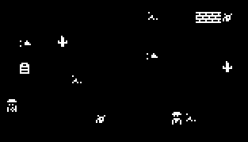
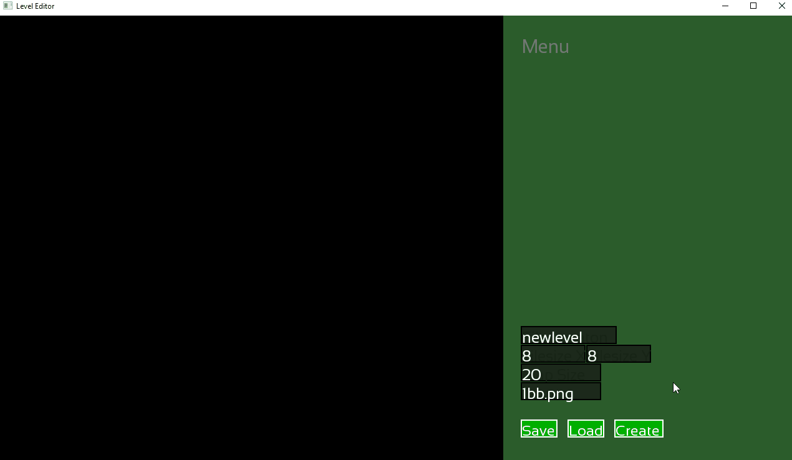
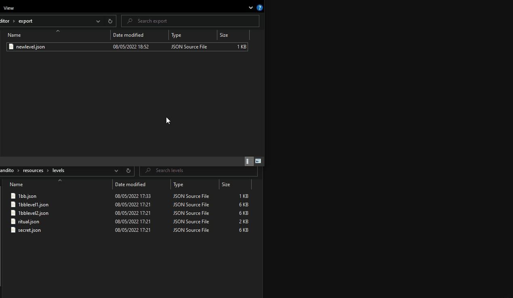

# 1 Bit Bandito

### Introduction
This is a repository for a simple game that I developed using C++ and the SFML library. It features a custom entity component system alongside AI and a separate level editor. Levels are stored using JSON and makes use of [nlohmann's JSON](https://github.com/nlohmann/json).

The objective of the game is to survive as long as possible against growing waves of enemies. High scores are stored locally and persist through closing and opening the game.

### Controls
WASD - Up, Left, Down, Right
Arrow keys - Shoot Up, Left, Down, Right

All inputs work off tapping the keys.

### Features

##### Optimisations
The game features a very flexible entity component system alongside a very simplistic AI. It makes use of object pooling to offer optimal performance instead of constantly creating and destroying objects. It makes use of a texture manager to handle sprites, using the texture manager allows for objects to share pointers to a single sprite rather than each object having their own sprite data.

##### Object Pooling
The main objects that are pooled are the enemies, weapon's bullets. Due to the bullets being pooled along with the theme of the game, each character can only have 6 bullets active at a time. Bullets are refunded when hitting the edge of the map or an object such as a wall.

##### Map Editor
Alongside the game there is a simple map editor, where users can create and save maps. To create a new level, open the level editor and enter the filename, the tile map's X Y dimensions and the size of the map in tiles, before finally entering the texture name.

The tile set file must be in the `tilesets` folder. You can then click to select the tile you want to paint on the right hand side of the editor, you can also hold control and left click to act as a dropper tool. Once finished hit save and the map will be written to the export folder.

Custom maps can be loaded by placing the map's JSON file in `resources > levels`, and if it makes use of a custom tile map, place the custom tile map in `resources > tilemaps`. To load the custom map in game type their name at the level select screen and press the button.

